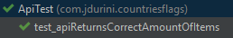

# Paypal's code Challenge

## Overview

1. Develop an Android application that will display a list of countries consumed from a REST API
2. https://github.com/7miler/codechallenge can be used to help you get started
3. Can be written in the language of your choice
4. Can use any open source libraries that you see fit
5. We would like to see a bug-free app, with a clean UI, that is written with a modern architecture
6. Please submit your project via a link to GitHub, Bitbucket or GitLab

## Goals
1. Consume https://mobile.xoom.com/catalog/v2/countries?page=<PAGE>&page_size=<PAGE_SIZE>
2. Display a simple list of the countries retrieved
3. Display a country flag for each country in the list (country flags can be obtained from https://countryflags.io)
4. Write unit tests where applicable

## Solution

### Architecture

This challenge was made using the MVVM android's architecture. One of the biggests advantages of MVVM is the separation of concerns. Here, all views (in our app's case, Fragments) are just concerned on displaying all the widgets needed for the view. ViewModels are the intermediate between views and data sources. In our case, ViewModels are the ones in charge of retrieve countrie's data via an third party API.

### Dependency Injection

The library choosen to handle dependency injection related stuff was [Dagger](https://dagger.dev/). To achive this, the following architecture was followed:


* AppComponent: interface annotated with `@Singleton` that will be used in all of the application's lifecycle. This component exposes the `Application` object so that every other sub-component could make use of it. This component is instanziated within the `BaseApplication` class, so that it knows it needs to be used during the whole app.
    * ActivityBuildersModule: contains the reference of all the modules that are going to be used within the MainActivity.
    * AppModule: contains the objects that are going to be injected to all the clients of the AppComponent. In our case, only retrofit was added here.
    * ViewModelFactoryModule: ironically viewmodels do not work well with dagger natively. There is no way where we could write constructor injection without a workaround. This class is the most known solution to solve that. It gives viewmodels the ability to use constructor injection.
* MainComponent: component that provides all necessary dependences during the `MainActivity` lifecycle. This app only has one activity, so this class could be seen as unnecesary, but it was made to exemplify how to work with subcomponents and dagger.
    * MainModule: has all the objects that are injected in MainComponent's clients. API, layout manager and adapter are provided here.
    * MainFragmentBuildersModule: contains the reference of all the modules that fragments within MainActivity are going to use.
    * CountriesViewModelsModule: additional class to make CountriesViewModel able to be injected.

### Internationalization

This app has the ability to be shown in spanish or english. Spanish strings are within the `res/values-es/strings.xml` folder.


### Pagination

The API provided has the advantage that it could be easily integrated with a pagination process. This helps a lot with the application's performance, because instead of fetching all the 232 countries with their flags, we are just requesting 20 flags per API call. To achive this, the recyclerview's scroll listener was tweak to use an _infinity scroll_ behavior.

### Image loading

[Glide library](https://github.com/bumptech/glide) was used to fetch each of the flags for every country.

### Unit Tests

Unit tests were added to ensure the application works as expected. There were 2 classes created:

#### API

In this class we have only 1 function that tests the correct behavior of the API. We test that, if we send 2 on the `pageSize` parameter, we recieve 2 **or less** items from the API.



#### ViewModel

First of all, note that `RobolectricTestRunner` was used to run the tests. This was needed given that we were testing `liveData` and `Observables`, so if we used the `MockitoJUnitRunner` class we would had the following exception:
```
Method getMainLooper in android.os.Looper not mocked
```

I also added a `mockSetup` function to run before the tests. In this function you will find this:
```java
RxJavaPlugins.setIoSchedulerHandler(scheduler -> Schedulers.trampoline());
```

This line is used to make all functions run synchronously, so that we can easilly test livedata's results.

Here are the 4 different scenarios that were tested:
* LiveData contains a successfult response
* LiveData value is null due to an unknow exception from our API
* The `hasFinishedFetchin` function returns `false` if there are countries left to be retrieved by the API.
* The `hasFinishedFetchin` function returns `true` given that there are no countries left to be retrieved by the API.


